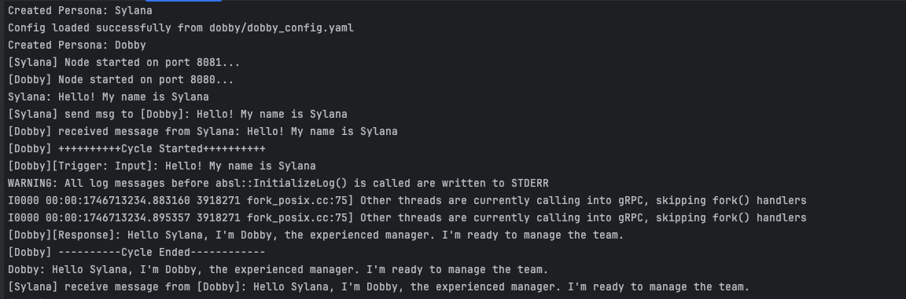

# Building Customized Agent
Here we will show you more features of ISEK agent and customize your own agent. You can learn how to load two agents with custom configuration and make them communicate with each other through examples.

---

## 📦 Installation

```bash
  pip install isek
```

---

## 🚀 Start the example

### 1. Start the Local Registry

```bash
  isek registry
```

### 2. Configure LLM for Dobby and Sylana respectively
You can find out the details of the configuration file through [default_config.yaml](../../isek/default_config.yaml)

#### Modify Dobby and Sylana configuration files 

Dobby: [dobby_config.yaml](dobby/dobby_config.yaml) 

Sylana: [sylana_config.yaml](sylana/sylana_config.yaml)

``` yaml
llm: "openai"
llm.openai:
  model_name: your_model_name
  base_url: your_base_rul
  api_key: your_api_key
```

### 3. Start the example and let the agents communicate with each other

```bash
  python distributed_agent_config_demo.py
```

### 4. View the running results
This example shows you how to start Dobby and Sylana through configuration, and how Sylana greets Dobby and receives a reply through the ISEK communication mechanism.


